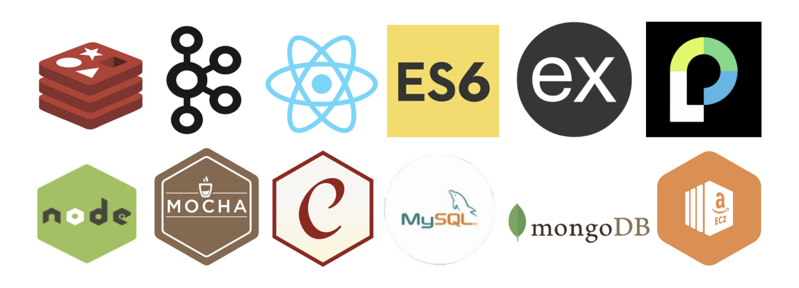

# Food Delivery App

> Individual Project for Gradaute Software Engineering course Enterprise Distributed Systems.

## Goal

* The goal is to build a distributed enterprise web application which allows the user to order their food online.
There are 2 actors in the system:

1. Restaurant Owner - Can add new restaurant, menu items, change status of orders.
2. Customers - Can search for different restaurants, dishes, place their order and view order status.

* We were tasked with this project requirement so that we can learn to build enterprise MERN stack applications using various distributed technologies such as Apache Kafka as message queues, Redis for caching, etc.

## System Design

### Technology stack

 
<table>
<thead>
<tr>
<th>Area</th>
<th>Technology</th>
</tr>
</thead>
<tbody>
	<tr>
		<td>Front-End</td>
		<td>React, React Router, Bootstrap, HTML5, CSS3, Javascript ( ES6 )</td>
	</tr>
	<tr>
		<td>Message Queue (Middleware)</td>
		<td>Apache Kafka</td>
	</tr>
	<tr>
		<td>Authentication Middleware</td>
		<td>Passport.js</td>
	</tr>
	<tr>
		<td>Back-End</td>
		<td>Express, Node.js</td>
	</tr>
	<tr>
		<td>In-Memory Caching / Datastore</td>
		<td>Redis</td>
	</tr>
	<tr>
		<td>API Testing</td>
		<td>Mocha, Chai, Postman</td>
	</tr>
	<tr>
		<td>Performance Testing</td>
		<td>JMeter</td>
	</tr>
	<tr>
		<td>Database</td>
		<td>MySQL (Amazon RDS), MongoDB (Mongo Atlas on AWS)</td>
	</tr>
    <tr>
		<td>Deployment</td>
		<td>Amazon Web Services</td>
	</tr>
</tbody>
</table>
 

### Database Design trade-offs
> Used MongoDB (NoSQL) to store large amounts of read heavy data which doesn't require transaction support such as Restaurant details, their menu items, etc.

> Used MySQL to store data which requires transaction support such as user profile information, order details, etc.

> Used database pl stored procedure for our booking and payment functionality so that we can provide transaction support and if anything goes wrong in between then we can roll back to a point where the database is in a consistent state.
